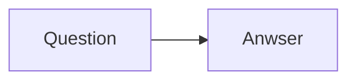
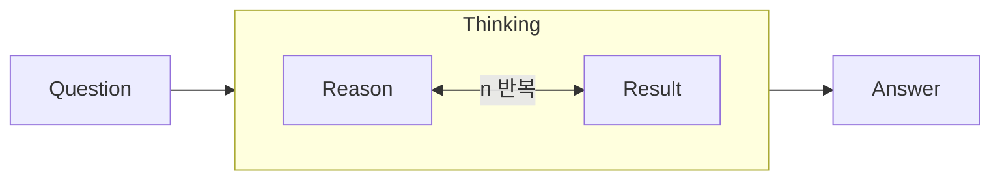
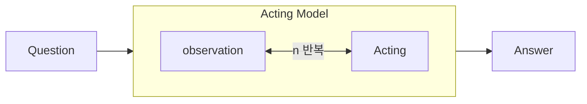
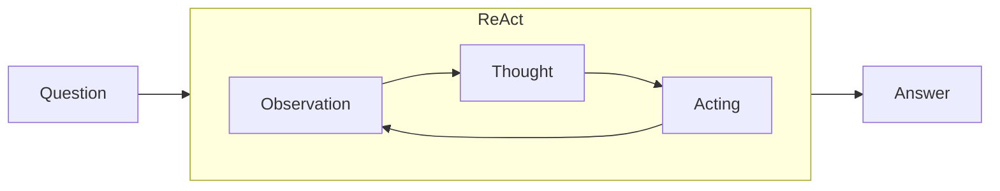



## 왜 Agent는 대세가 되었는가?  
질문에 대한 답을 먼저하자면 '성능이 더 좋기 때문'이다.  
Agent는 어디서 갑자기 나타난 용어지? 왜 agent라고 하지?  
최신 방법론에 예민한 우리는 **acl anthology**를 검색해본 결과, 현재 눈에 띄게 많이 검색되는 것을 볼 수 있다.
현재까지 살펴본 agent관련 논문을 보면 agent, acting, observation이라는 용어가 자주쓰인다. 이는 강화학습에서 자주 등장하는 용어로 그 얘기는 나중에 더 깊게 나눠보도록 하자.

LLM agent 또는 Agentic LLM 은 chat gpt의 말을 인용하자면 "환경과 상호작용한다" 라고 하지만 쉽게 말해 "상황을 파악하여 필요한 행동을 통해 목표를 달성한다" 이다. 과거의 input에 대한 output을 출력하는 단순한 구조가 아닌, 학습된 정보가 부족하면 모델의 판단 하에 '새 문서를 찾아온다', '현재 문서와 이어진 문서를 더 찾아본다'등의 행동을 취하는 것이다.

이처럼, LLM이 **상황을 파악해서 스스로 행동하여 원하는 결과값을 가져온다**는 것은 **Agent**라는 개념과 잘 맞아떨어진다. 어떠한 목표를 달성하기 위해 모델이 자체적으로 행동을 선택하는 부분에서 강화학습과 매우 유사하다 할 수 있지만 분명히 학습방식에서 차이가 있다.

2025년 현재 이슈인 여러 Agent 중 ReAct를 살펴보겠다.

## ReAct : Reasoning And Acting 
Princeton University과 Google Research, Brain team에서 게재한 논문은 `ReAct: Synergizing Reasoning And Acting in Language Models`으로 역시나 Language Model을 기반으로 한 것을 볼 수 있다. 

이 논문에서는 크게 두 가지의 모델과 비교를 하게 되는데 하나는 Reasoning Model, 하나는 Acting Model이다. 두 모델을 간략히 설명하고 넘어가겠다.

### **Reasoning**  
CoT(Chain-of-Thought), Reasoning Model은 우리가 chat gpt한테 질문을 하면 뺑글뻉글 돌면서 thinking,,, 하는 그 과정을 말한다.  
이 과정은 단순하게 설명하자면 우리의 질문에 대한 답변을 즉시 생성해내던 방법에서 답변 생성 동시에 그 답변을 낸 이유까지 한번 더 생각하게 하는 것을 말한다.

Exist Model

Reasoning Model

하지만 이 모델에는 치명적인 단점이 있다. 내재된 정보에 원하는 답변이 없을 경우, 원하는 결과를 얻을 수 없다는 뻔한 결과가 초래된다. 이러한 단점을 보완하기 위해 RAG와 같은 방법론들이 사용되고 있다.

### **Acting**  

Acting Model은 사용자가 모델이 호출할 API를 정의해주는 것으로 시작된다. 논문에서는 Search, LookUp, Finish 세가지 Action를 사용했다.

예를 통해 동작과정을 살펴보면 모델이 사용자의 Question에 내재된 정보만으로 답변할 수 없다고 판단하면, Search API를 호출하여 Wiki 등에서 정보를 가져온다.(이를 **환경과 상호작용한다**라고 표현)  
Observation = Retrieved Data로 생각해도 무방할 것이다.

Acting Model

하지만 논문에서는 Acting Model로도 정확한 답변을 얻을 수 없다고 한다.

Q1. 루프를 반복하여 정답이 나올 때까지 Acting을 하면 되지않을까?(라는 의문점이 생겼다)

논문에서는 Acting Model은 '추론' 없이 행동(action)만 생성하기 때문에 정답에 도달하지 못한다고 한다.  
Acting-only Model이 성능이 낮은 이유를 매우 구체적으로 분석하고 있는데 Model이 '이 Action은 성공적이었는가?', '다음에 어떤 행동을 취해야하는가?'와 같은 고차적 판단이 불가능하다고 말하고 있다.

*Act fails to comprehend from the context... thus keeps producing hallucinating actions*을 해석해보자면 Acting-only Model은 검색 결과가 무의미할때, 다른 경로로 전환해야할 때 판단하여 경로를 바꿀 수 없다고 표현했다.  
다시 말해  'A가 검색 되지 않았다' -> 'B를 검색해보자' 와 같은 Action 전략을 스스로 고안할 수 없다는 것이다.

### **ReAct**  
'Thought를 기반으로 Acting을 하자, 사람처럼 생각한 후에 행동하자'가 이 논문의 핵심이다.

논문에 쓰인 용어로는 Thought를 먼저 한 후 Action을 취하자는 건데, 사용자 Question에 대해 Thought를 먼저 생성하고 Thought을 바탕으로 어떤 것을 행동을 취할지 model이 결정한다.

ReAct Model

**ReAct**는 기존 Acting space (A)에 Thought space (L)을 확장시켰다. $$\hat{A} = A \cup L  $$  
따라서 행동은 두 가지 중 하나가 될 수 있다. 
- $$\hat{a}_t \in A$$: 실제 환경을 변화시키는 **Act**
- $$\hat{a}_t \in L$$: 언어적 reasoning인 **Thought**

Q2. 자연어공간 L은 사실상 무한(infinite)인데 학습을 어떻게 시킬까?  

이 부분에 대해서 논문은 *…as the language space L is unlimited, learning in this augmented action space is difficult and requires strong language priors*라고 표현한다.  
즉, LM이 생성할 수 있는 thought는 조합적으로 무한히 다양해질 수 있고 학습하는 것은 매우 어렵다. 그러므로, 답변이 산으로 갈 수도 있어!(해결책을 제시하지 않음)

## 요약

논문에서 '단순한 Reasoning Model과 Acting Model로는 사용자 질문에 대한 정확한 답변을 할 수 없다. 모델이 필요 시 외부 정보를 가져다 쓰게 하되, 그 판단도 니가 해' 라고 말한다. 

이를 서론에서는 다음과 같은 재밌는 묘사를 통해 자연스럽게 'Agent'라는 개념으로 연결시켰다.
1. 요리를 할 때 사람은 냉장고 열기 전에 '재료가 있나 먼저 확인해야지.(Thought)'
2. 냉장고 문을 연다.(Acting)
3. 재료를 보고 난뒤 '면은 있으니까 물부터 끓여야겠다.(Thought)'
4. 물을 끓인다.(Acting)
5. 요리 중간에 재료가 없으면 '소금이 없네. 그럼 간장으로 대체해야겠다.(Thought)'

이후 행동(Act)이 이어진다..

## 마치며

Model의 experiment부분을 제외한 이유는 당연스럽게도 본인들의 Model이 성능이 가장 좋다고 하고 있다.
잘 학습되어있는 GPT 3을 가져다 사용했고, fine-tuning은 진행하지 않고 prompting 방법을 통해 성능을 끌어올렸다고 한다. 

눈에 띄는 것은 Few shot vs Fine-tuning부분인데 model을 fine-tuning시키는 것이 더 좋지만 540b짜리 model은 수치가 측정이 안되어있다.(구글팀에서도 이정도 자원은 감당이 안되었나보다.)  

사실 강화학습에 대해 지식이 있는 사람이라면 논문에서 언급한 환경의 변화, Action space 등의 단어들이 생소하진 않을거다.
논점은 입력에 대한 결과만 내어주는 것이 끝이 아니라,
프로그래밍으로 예를 들면 chat gpt야 oo프로그램을 만들어봐 했을 때, 프로그램을 생성 -> 실행 -> 오류제거 및 재실행 -> 리팩토링과 같은 일련의 과정을 완벽히 수행해 내는 기술이 Agent이고 이러한 방향으로 진화하고 있다는 점이다.