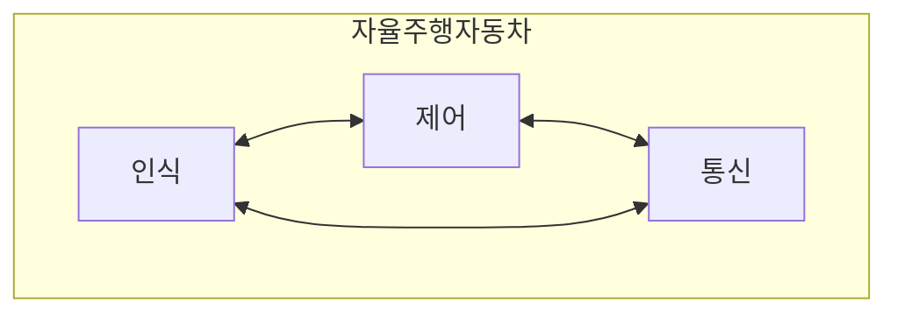

## 인공지능 모델은 한 가지 일만 할 수 있다.
한 가지 task를 수행하는 모델을 개발하는 것은 쉽다.

*사진에 있는 동물을 맞추는 모델*을 생각해보자.
이 모델은 사진을 보고, 동물의 종류를 맞춘다. 
이건 생각보다 쉽다.
이미 한참 전에 정복된 영역이다.
비슷하게 다른 task를 수행하는 모델도 비슷하게 잘 해내고 있다.

그러나, **세상은 훨씬 복잡하다**.
단순 task로 해결될 수 없는 굉장히 복잡한 task들이 존재한다.
그럼, 이런 복잡한 task를 작은 task로 나누고 각각 처리하면 어떨까?
(Divide and conquer에 대해 들어보았을 것이다.)

**자율주행자동차**에 대해서 생각해보자.
아직까지 완벽한 자율주행은 불가능하다고 알려져있다.
굉장히 복잡한 task이기 때문이다.
이를 divide and conquer로 다루기 위해, 다음처럼 세부 task로 분할했다고 생각해보자.

세부 task들을 분할했으니, [인식, 제어, 통신] 각각을 담당하는 인공지능 모델을 학습한다.
이 모델들은 각 task에서 최고 성능을 보인다고 가정하자.
그리고 이들을 하나의 자율주행차량에 집어넣었다.
이제 이 자율주행차량은 사람이 운전하는 수준으로 사고없이 안전한 운행을 할 수 있을까?

아마 뜻대로 되지 않을 가능성이 높다.
왜냐면, 사람은 이 모든 일을 혼자 처리하기 때문이다.
스스로 인지하진 못하지만, 이 모든 세부 과제들을 순식간에 번갈아가며 처리하고, 그로부터 얻은 정보들을 **유기적으로 결합**함으로써 안전한 운행을 수행할 수 있는 것이다.

사람이 운전하는 차와 우리가 만든 가상의 자율주행자동차와의 차이점은 바로 이 부분에 있다.
앞서 본 가상의 자율주행자동차의 각 task를 담당하는 인공지능 모델들은 각자의 기능은 잘 하지만, 이들은 다 *따로논다.*
그러나, 각 기능을 잘 하는 것도 중요하나, 궁극적으로는 안전한 운행이라는 **공동의 목표를 이룰 수 있어야 한다**.
단순히 이들을 합쳐둔다고 그것이 가능해지진 않는다.

그래서 최근 이처럼 공동의 목표를 이루기 위해 여러 인공지능 모델들이 협력하는 방식에 대한 많은 연구들이 이뤄지고 있다.
그 대표적인 방식이 `Multi Agent System`이다.

## Multi Agent System (MAS)


