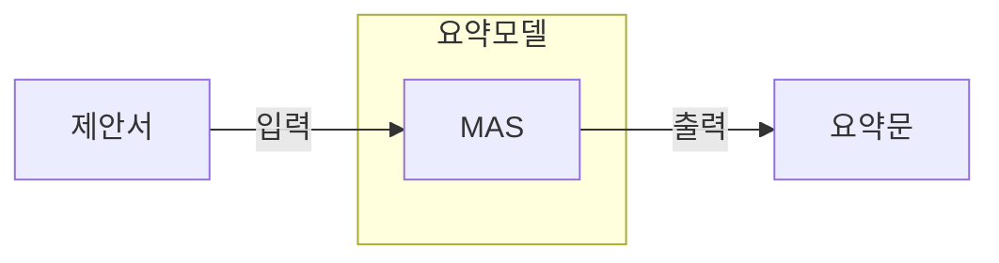
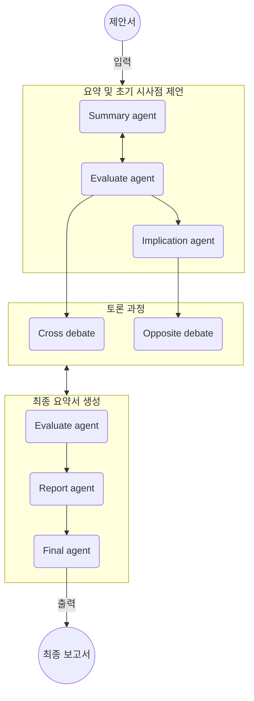
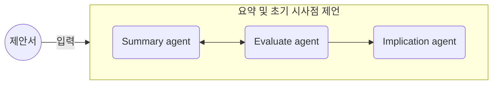
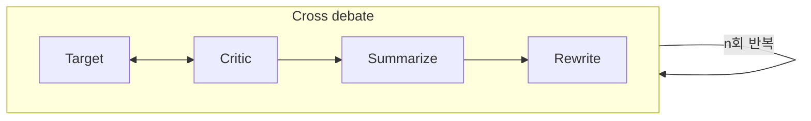
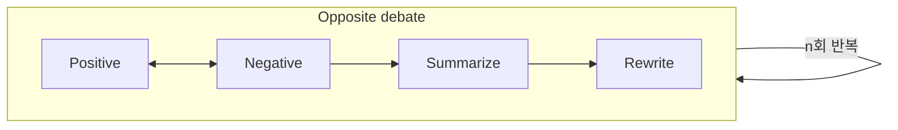
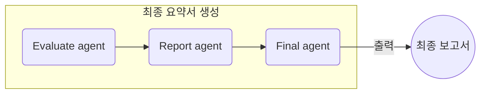

## 들어가며
이번 포스트에서는 올해 개최되었던 한 HCLT2025 논문 (`Multi Agent System을 활용한 제안서 요약 - 2025 HCLT`)의 내용의 도움을 받아, MAS가 무엇이고 어떻게 활용할 수 있는지 느껴보도록 하자.

논문의 내용을 기반으로 포스팅을 작성하되, 단순히 논문의 내용을 전달하진 않는다.
우린 이 논문을 통해 MAS의 개념과 이를 활용하는 방식을 맛보는 것을 목표로 하며, 이를 위해 필자의 해석과 견해가 포함될 수도 있다.

## 논문 제목에서 알 수 있는 것.
우리는 이 논문의 제목에서 다음의 키워드들을 추려낼 수 있다.

1. Multi agent system (MAS)
1. 요약
1. 제안서

이들을 보면 자연어 처리 분야에서 자주 보이는 키워드가 있다.
바로 `요약`이다.
Language model의 대표적인 응용 분야가 요약이다.
여러 문장으로 구성된 문서를 보고, 이들로부터 중요한 내용을 몇개의 문장으로 출력하는 것이 그 목적이다.
그리고 이 요약의 대상을 `제안서`로 두고 있는 것이다.

그러면 우린 이에 대해 의문을 가질 수 있다.
이미 오랫동안 연구해오던 것인데, 무언가 새로운 패러다임이 있는 것인가?
기존의 요약과 무엇이 다른가?

아마 그 새로운 부분으로 `multi agent system`을 차용한 것이 분명해보인다.
그러면, 먼저 각 키워드들의 정의에 대해서 알아보자.

## 알고가야할 개념들
### Multi agent system (MAS)
MAS는 **서로 다른 역할**을 하는 에이전트들로 구성되고, 그들 간의 **상호작용**을 통해 그들의 공동의 목표를 달성하는 것을 목표로하는 시스템이다.
이들은 *단순히 여러 개의 모델들로 구성되어 특정 업무를 나눠서 수행하는 시스템*과는 **상호작용**을 한다는 점에서 차이가 있다.

가령, 머신러닝과 딥러닝 모델들로 자율주행자동차를 만들었다고 생각해보자.
그들 간의 소통하는 기능없이 각자 맡은 일만 수행한다면, 그 작은 각자의 목표만을 위해서 각 모델들은 움직일 것이다.
어쩌면, 그 작은 목표는 시스템의 공동의 목표를 오히려 저해하는 방향으로 작용할 수도 있다.
축구팀에서 각자 선수들이 뛰어나다고 해서 항상 우승하는 것은 아닌 것과 일맥상통한다.

MAS와 같은 방식은 단일 시스템 대비 **강건성과 확장성, 그리고 유연성**과 같은 강점을 갖는다.
그리고, 공동 목표와 에이전트들 간 상호작용 없이 단순히 병렬 구성된 시스템 대비 우수성을 갖는다.

### 도메인 특화 보고서 생성
앞서 언급한 것과 같이 요약을 제안서에 적용한 게 이 논문이다.
여기서는 그 요약문을 최종적을 *보고서*로 출력하는 걸 목표로 하고있다.

*도메인 특화 보고서 생성*이라는 주제 또한 많은 연구들이 이뤄져오고 있는 주제다.
이들 연구는 다음과 같은 순서로 발전되어 오고 있다.

1. 대규모 데이터셋에 기반한 단일 모델만 사용하는 방식
1. 여러 agent들을 병렬로 구성하되, 상호소통은 없는 방식:  
    이 시도에서는 오히려 **단일 모델을 쓰는 경우보다 성능이 떨어졌다**!

이런 흐름 속에서, 이 논문은 단순히 업무를 여러 개로 나눠서 분담하도록 하는 것이 중요한 게 아니라, 그들 *업무를 담당하는 에이전트들 (그러니까 모델들) 간의 상호소통*이 매우 중요하다고 주장한다.
이런 부분은 [인공지능 모델들 간의 협력의 필요성](../multi-agent-system/)에서 다룬 것처럼 어느정도는 직관적으로 떠올릴 수 있는 통찰이다.

## 이 논문에서 MAS를 구성한 방식
앞에서 MAS는 여러 모델들이 서로 다른 역할을 수행하도록 구성한다고 언급했었다.
이 논문에서는 도메인 특화 보고서 생성이라는 요약 과제를 다음처럼 세부 역할들로 분할했다.

1. 핵심 내용 요약
1. 정책적, 기술적, 조직 운영 관점에서 시사점 및 제언 생성
1. 시사점 및 제언에 대한 토론
1. 시사점과 제언에 대한 평가
1. 최종 리포트 생성

잘 살펴보면, 이는 회사에서 여러 사람들이 보고서를 만드는 과정과 상당히 유사해 보인다.
(조만간 인공지능이 인간을 대체한다는 것이 현실에서 보이기 시작한 것일지도 모르겠다.)

각 역할마다 한 개의 인공지능 모델을 둘 수도 있고, 여러 개의 인공지능 모델을 둘 수도 있을 것이다.
그리고 각 인공지능 모델의 크기는 논문에 명시되진 않았으나, 전부 ChatGPT 수준으로 큰 모델을 사용하진 않았을 것이라 생각된다.
MAS를 다른 과제에 적용해본다면 머신러닝 모델을 채택해도 가능하지 않을까 생각이 된다.

## 이 논문의 MAS pipeline
이 논문은 앞서 나눈 세부 역할에 기반하여 MAS를 설계하였으며 그 구조는 다음과 같다.

여기서 MAS는 크게 세 부분으로 구성되어 있다.

1. 요약 및 초기 시사점 제언
1. 토론 과정 & 시사점 및 제언 생성
1. 최종 요약서 생성

각각을 내부적으로 들여다보면서, 어떤 부분에서 상호소통이 발생하는가를 보도록 하자.
(상호소통이 핵심이라고 언급했었다!)

### 요약 및 초기 시사점 제언

1단계 `요약 및 초기 시사점 제언`에서는 세 개의 에이전트들이 입력된 문서를 보고 요약하고, 그 요약을 보고 평가하고, 다시 요약을 하는 작업을 반복한다.
그리고 어느 정도 요약이 되면 그걸 기반으로 제언을 뽑아낸다.
제언은 요약문에 기반하여 의사결정에 사용할 수 있는 가치있는 통찰을 뽑아낸 것이라 해석된다.

여기서 상호소통을 하는 부분은, **summarize agent가 요약하고, 요약본을 보고 평가를 내리는 evaluate agent가 그걸 보고 평가를 한다는 것**이다.
그리고 평가에서 떨어진다면, 다시 요약본을 만드는 과정을 둔다.
이 부분에서 모델들이 서로 상호소통이 이뤄진다.

### 토론 과정 - cross debate
cross debate는 내부적으로 다시 네 개의 모델들이 토론을 진행하고, 요약본 작성한다.
토론이기 때문에 *Target과 Critic은 서로 상반되는 입장을 주장하도록 설계*되었으며, Critic의 비평을 보고 Target은 그 비평을 반영하여 *답변서*도 생성한다.
이 부분에서 **상호소통**이 발생한다.

### 토론 과정 - opposite debate
opposite debate도 cross debate와 완전히 동일한 구조를 가지고 있다.
다만 여기선 Positive와 Negative라는 주장을 하는 에이전트들을 배치했다는 부분만 다르다.
따라서 그 과정에 동일하게 **상호소통**이 발생한다.

### 최종 요약서 생성
위 두 개의 debate 결과를 합치고 취합한다.
그리고 이에 기반하여 최종적으로 평가하고 정리하여 최종 보고서를 생성한다.

## MAS 적용 사례에서 우리가 알 수 있는 것들
우린 이 논문의 사례를 통해, 어떻게 MAS를 사용할 것인지 어느정도 알게되었다.

1. MAS가 최종적으로 달성할 *공동의 목표*를 설정한다.
1. 공동의 목표를 *세부 목표로 분할하되, 겹치지 않도록* 만든다.
1. 파이프라인을 구성할 때 에이전트들 간 출력이 오가는 *상호소통*을 필히 포함한다.

## 정리하며
이런 기준을 가지고 각자가 풀고자하는 과제에 MAS를 어떻게 적용할 수 있을지 한 번 구상해본다면 재밌지 않을까 생각된다.
각자 한 번 생각해보도록 하자.

필자도 기회가 된다면 이전 포스트에서 예시로 들었던 자율주행자동차를 위한 MAS에 대해 구상해보는 것을 다룰 생각이다.


